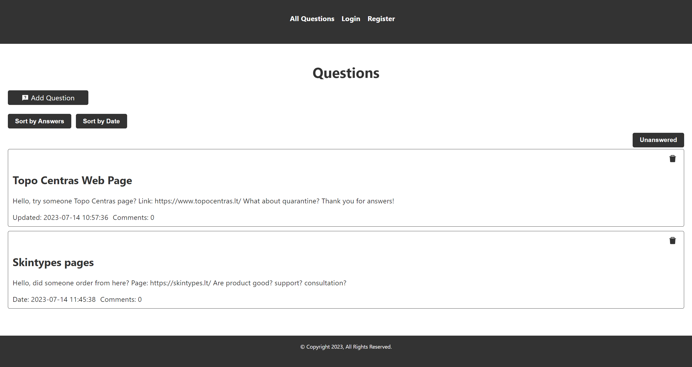
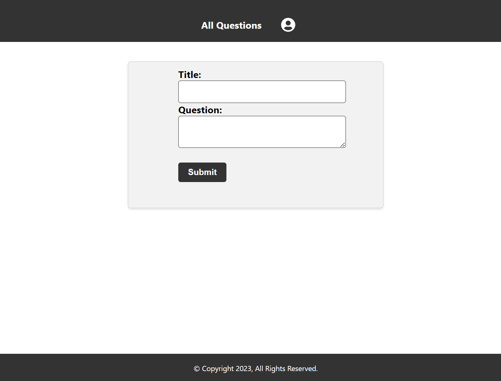
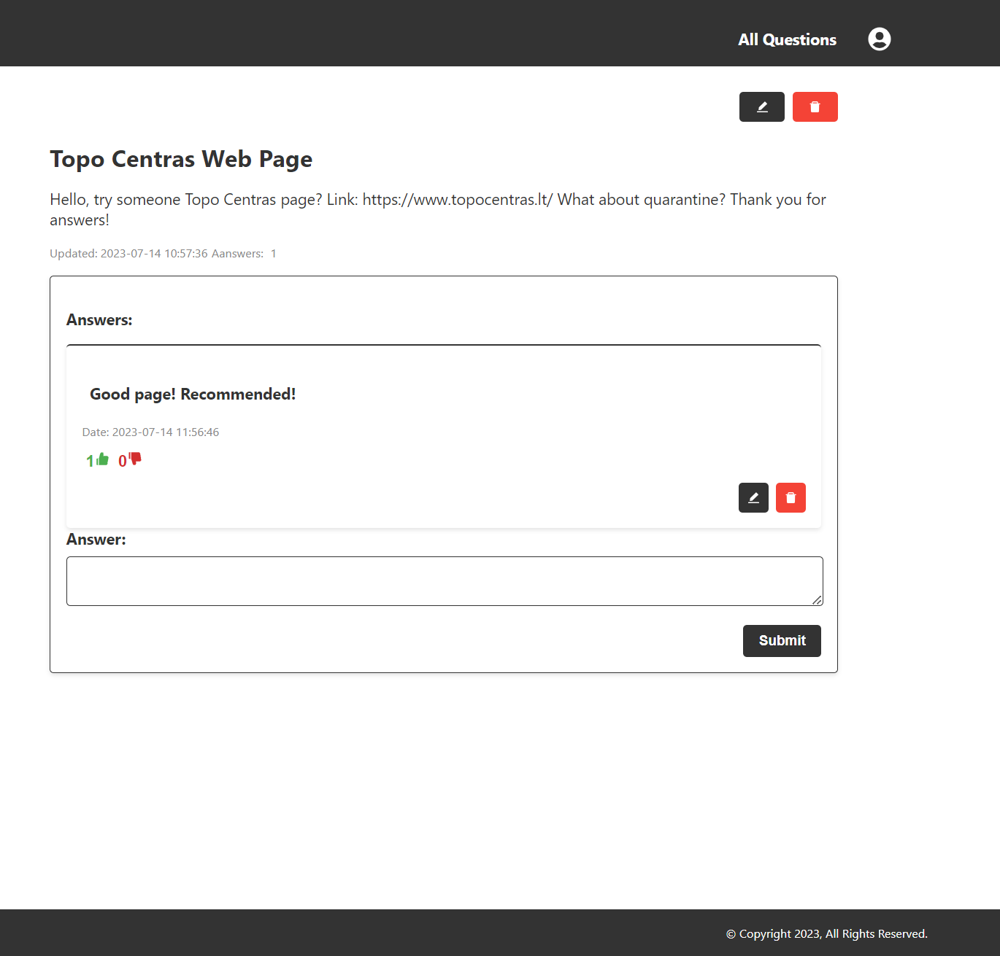

<h1  align="center"> Web Page Commercial Reviews </h1>   

Web Page Commercial Reviews  Built with Node and React .

## Features for Login

A few of the things Login have:

- Check password and username

- Alert about wrong password or username

- Save login information

## Features for Registration

A few of the things Registration have:

- Check password and confirm password

- Alert about wrong password and password confirmation matching

- Alert if the user exist

## Features for Questions

A few of the things Questions page you can see:

- All Questions

- Check all unanswered questions

- When click to title, go all information about exact question

- Sort questions by answers and by date

- Delete question

- Comments/answers number

- Creation date and updated date (writing that date are updated)

- Add question

## Features for Add Question

A few of the things Add Question page you can see:

- Write title and content for question

- Alert if textarea are empty

- After submit -> alert that question created and link to all questions

## Features for one Question

A few of the things see in one Question page :

- If you owner of question you can delete or edit

- If you owner of answer/comment you can delete or edit

- Can like or dislike answer

- Can add new answer

- See all question information
